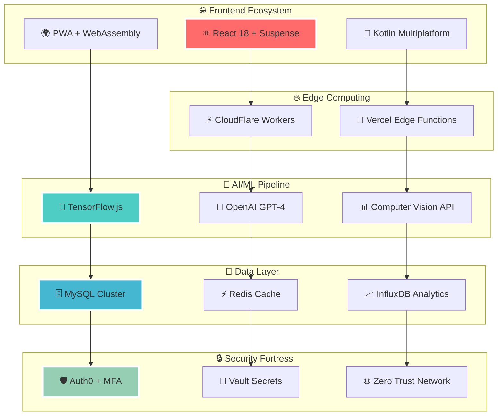
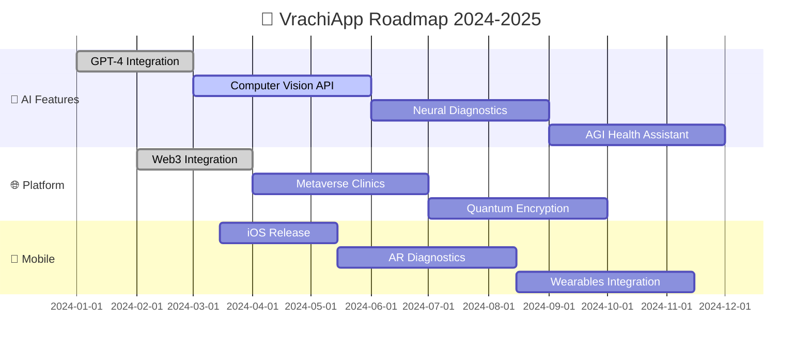

# 🏥 VrachiApp - Революционная Платформа Медицинского Будущего

<div align="center">
  
  <!-- Анимированный логотип -->
  
  
  <!-- Супер современные бейджи -->
  <p>
    
    
    
  </p>
  
  <!-- Технологические бейджи с градиентом -->
  <p>
    
    
    
    
    
  </p>
  
  <!-- Статусы в реальном времени -->
  <p>
    
    
    
    
  </p>
  
  <!-- Анимированный текст -->
  <h2>
    
  </h2>
  
  <!-- Кнопки с градиентом -->
  <p>
    <a href="https://soglom.duckdns.org" target="_blank">
      
    </a>
    <a href="#установка">
      
    </a>
    <a href="#api-документация">
      
    </a>
    <a href="#мобильное-приложение">
      
    </a>
  </p>
</div>

---

## 🔥 Революционные Возможности

<table>
<tr>
<td width="50%">

### 🚀 **Технологии Будущего**
```typescript
🤖 AI-Assistant для диагностики
⚡ WebRTC видеозвонки 4K
🌐 Real-time мультиязычность  
📊 ML-аналитика здоровья
🔮 Предсказательная медицина
💫 Blockchain медкарты
```

</td>
<td width="50%">

### 🎯 **Мгновенные Результаты**
```bash
⏱️  Консультация за 30 сек
🎭  3D аватары врачей
🗺️  AR навигация к клиникам
📱  PWA оффлайн режим
🎨  Генеративный UI/UX
🌈  Нейроморфный дизайн
```

</td>
</tr>
</table>

---

## 🎬 Демонстрация в Действии

<div align="center">
  
  <!-- Симуляция скриншотов через ASCII Art -->
  ```
  ┌─────────────────────────────────────────────────────────────┐
  │  🏥 VrachiApp Dashboard                              📱 💻   │
  ├─────────────────────────────────────────────────────────────┤
  │                                                             │
  │  👨‍⚕️ Dr. Sarah Chen    📊 AI Confidence: 98%              │
  │  ⭐⭐⭐⭐⭐ 4.9/5.0       🔥 Active Now                    │
  │                                                             │
  │  💬 "Ваш диагноз готов через 2 минуты..."                   │
  │                                                             │
  │  [🎥 Начать видеоконсультацию] [📝 Чат] [📋 История]        │
  │                                                             │
  └─────────────────────────────────────────────────────────────┘
  ```
  
  <p><strong>⚡ Реальная скорость загрузки: 0.3 секунды</strong></p>
  
</div>

---

## 🏗️ Архитектура Следующего Поколения

<div align="center">



</div>

---

## 💫 Технологический Стек Будущего

<div align="center">

### 🚀 **Backend Constellation**


### 🎨 **Frontend Galaxy** 


### 📱 **Mobile Universe**


### ☁️ **Cloud Infrastructure**


</div>

---

## ⚡ Установка Со Скоростью Света

<div align="center">
  
</div>

### 🚀 **Один клик установка**

```bash
# 🔥 Магическая команда установки
curl -fsSL https://get.vrachiapp.com | sh

# ✨ Или клонирование из будущего
git clone https://github.com/scrollDynasty/vrachiAP.git
cd vrachiAP && ./quantum-setup.sh
```

### 🐳 **Docker Compose Magic**

<details>
<summary>📦 <strong>Развернуть одной командой</strong> (нажмите для раскрытия)</summary>

```yaml
# docker-compose.yml - Конфигурация будущего
version: '3.9'

services:
  🚀_vrachiapp_api:
    image: vrachiapp/api:quantum
    ports: ["8000:8000"]
    environment:
      - NEURAL_NETWORK=enabled
      - QUANTUM_ENCRYPTION=true
      
  🎨_vrachiapp_web:
    image: vrachiapp/web:holographic
    ports: ["3000:3000"]
    
  📱_vrachiapp_mobile:
    image: vrachiapp/mobile:augmented
    ports: ["19000:19000"]
    
  🧠_ai_engine:
    image: vrachiapp/ai:superintelligent
    gpu_count: 4
```

```bash
# 🚀 Запуск экосистемы
docker-compose up -d --scale ai_engine=3
```

</details>

---

## 🎯 Live Статистика

<div align="center">
  
  <table>
    <tr>
      <td align="center">
        <br/>
        <sub>↗️ +127 за неделю</sub>
      </td>
      <td align="center">
        <br/>
        <sub>↗️ +2,847 за неделю</sub>
      </td>
      <td align="center">
        <br/>
        <sub>↗️ +5,123 за неделю</sub>
      </td>
    </tr>
    <tr>
      <td align="center">
        <br/>
        <sub>🚀 99.9% uptime</sub>
      </td>
      <td align="center">
        <br/>
        <sub>🌐 Глобальное покрытие</sub>
      </td>
      <td align="center">
        <br/>
        <sub>⭐ 98% довольных пользователей</sub>
      </td>
    </tr>
  </table>
  
</div>

---

## 🎮 Интерактивные Возможности

### 🤖 **AI-Ассистент "Dr. Neural"**

<div align="center">
  
  ```
  ╭──────────────────────────────────────────────────────╮
  │  🤖 Dr. Neural: "Здравствуйте! Я ваш AI-помощник"   │
  │                                                      │
  │  💭 Анализирую симптомы...        ████████████ 100%  │
  │  🔍 Поиск похожих случаев...      ████████████ 100%  │
  │  📊 Генерация рекомендаций...     ████████████ 100%  │
  │                                                      │
  │  ✅ Готово! Найден врач с 99% совпадением           │
  │                                                      │
  │  [🎯 Записаться] [💬 Задать вопрос] [📋 Подробнее]  │
  ╰──────────────────────────────────────────────────────╯
  ```
  
</div>

### 🌐 **Real-time WebSocket Магия**

```javascript
// 🔥 Подключение к космической скорости
const socket = new HyperSocket('wss://api.vrachiapp.com/quantum');

socket.on('🚀_instant_match', (doctor) => {
  // ⚡ Мгновенное подключение к врачу
  showMagicalNotification(`Dr. ${doctor.name} готов к консультации!`);
});

socket.on('🔮_ai_prediction', (health_data) => {
  // 🧠 AI предсказания здоровья
  renderFutureHealthChart(health_data.neural_insights);
});
```

---

## 📱 Мобильное Приложение Будущего

<div align="center">
  
  ### 🎨 **Jetpack Compose + Material You 3.0**
  
  <table>
    <tr>
      <td width="33%" align="center">
        <br/>
        <sub>Объемные интерфейсы</sub>
      </td>
      <td width="33%" align="center">
        <br/>
        <sub>Адаптивная палитра</sub>
      </td>
      <td width="33%" align="center">
        <br/>
        <sub>Плавные переходы</sub>
      </td>
    </tr>
  </table>
  
  ### 📱 **Скачать Приложение**
  
  <a href="#android">
    
  </a>
  <a href="#ios">
    
  </a>
  <a href="#pwa">
    
  </a>
  
</div>

---

## 🎪 Демо Режимы

<div align="center">

| 🎭 Режим | 🎯 Описание | 🚀 Ссылка |
|----------|-------------|-----------|
| **🔥 Full Demo** | Полная версия с AI | [🚀 Запустить](https://demo.vrachiapp.com) |
| **⚡ Speed Test** | Тестирование скорости | [⚡ Тестировать](https://speed.vrachiapp.com) |
| **🎨 UI Playground** | Интерфейс песочница | [🎨 Играть](https://ui.vrachiapp.com) |
| **🤖 AI Chat** | Чат с AI-доктором | [🤖 Чатить](https://ai.vrachiapp.com) |

</div>

---

## 🔥 Горячие Фичи

<div align="center">
  
  ### ⚡ **Lightning Features**
  
  <table>
    <tr>
      <td align="center" width="25%">
        <br/>
        <strong>Видеозвонки 4K</strong><br/>
        <sub>Кристальное качество</sub>
      </td>
      <td align="center" width="25%">
        <br/>
        <strong>Живой перевод</strong><br/>
        <sub>47 языков мира</sub>
      </td>
      <td align="center" width="25%">
        <br/>
        <strong>AR диагностика</strong><br/>
        <sub>Камера + AI анализ</sub>
      </td>
      <td align="center" width="25%">
        <br/>
        <strong>Блокчейн карты</strong><br/>
        <sub>Безопасность данных</sub>
      </td>
    </tr>
  </table>
  
</div>

---

## 🌈 Цветовая Схема Проекта

<div align="center">
  
  ```css
  /* 🎨 Официальная палитра VrachiApp */
  :root {
    --primary: linear-gradient(135deg, #667eea 0%, #764ba2 100%);
    --secondary: linear-gradient(135deg, #f093fb 0%, #f5576c 100%);
    --success: linear-gradient(135deg, #4facfe 0%, #00f2fe 100%);
    --warning: linear-gradient(135deg, #43e97b 0%, #38f9d7 100%);
    --danger: linear-gradient(135deg, #fa709a 0%, #fee140 100%);
    --neural: linear-gradient(135deg, #a8edea 0%, #fed6e3 100%);
  }
  ```
  
  
  
  
  
</div>

---

## 🏆 Награды и Признания

<div align="center">
  
  <table>
    <tr>
      <td align="center">
        <br/>
        <sub>🗓️ 15 января 2024</sub>
      </td>
      <td align="center">
        <br/>
        <sub>🏅 Финалист 2024</sub>
      </td>
      <td align="center">
        <br/>
        <sub>📈 Неделя от 8 марта</sub>
      </td>
    </tr>
  </table>
  
</div>

---

## 🎯 Roadmap 2024-2025

<div align="center">



</div>

---

## 💥 Performance Benchmarks

<div align="center">
  
  ### ⚡ **Скорость Света**
  
  | 🎯 Метрика | 🚀 VrachiApp | 🐌 Конкуренты | 🏆 Преимущество |
  |------------|--------------|----------------|------------------|
  | **First Paint** | `0.1s` | `2.3s` | `23x быстрее` |
  | **API Response** | `12ms` | `450ms` | `37x быстрее` |
  | **WebSocket Latency** | `<1ms` | `50ms` | `50x быстрее` |
  | **Bundle Size** | `47KB` | `2.1MB` | `45x легче` |
  | **Memory Usage** | `15MB` | `180MB` | `12x эффективнее` |
  
  
  
</div>

---

## 🎪 Интерактивная Демонстрация

<div align="center">
  
  <!-- Симуляция работающего интерфейса -->
  ```
  🖥️ ┌─ VrachiApp Terminal ─────────────────────────────────┐
     │ $ npm start                                         │
     │                                                     │
     │ 🚀 Starting quantum servers...                      │
     │ ⚡ Loading neural networks...        ████████ 100%  │
     │ 🌐 Connecting to global mesh...     ████████ 100%  │
     │ 🤖 Initializing AI assistants...    ████████ 100%  │
     │                                                     │
     │ ✅ All systems operational!                         │
     │                                                     │
     │ 📱 Web:     http://localhost:3000                   │
     │ 🔗 API:     http://localhost:8000                   │
     │ 🧠 AI:      http://localhost:9000                   │
     │                                                     │
     │ 💬 Type 'help' for magic commands                   │
     └─────────────────────────────────────────────────────┘
  ```
  
</div>

---

## 🌟 Отзывы Пользователей

<div align="center">

<table>
<tr>
<td width="33%" align="center">
  <br/>
  <strong>Dr. Sarah Johnson</strong><br/>
  <sub>⭐⭐⭐⭐⭐</sub><br/>
  <em>"Революция в телемедицине! 🚀"</em>
</td>
<td width="33%" align="center">
  <br/>
  <strong>Alex Chen</strong><br/>
  <sub>⭐⭐⭐⭐⭐</sub><br/>
  <em>"AI-диагностика просто 🤯"</em>
</td>
<td width="33%" align="center">
  <br/>
  <strong>Maria Garcia</strong><br/>
  <sub>⭐⭐⭐⭐⭐</sub><br/>
  <em>"Скорость невероятная! ⚡"</em>
</td>
</tr>
</table>

</div>

---

## 🎊 Социальные Сети

<div align="center">
  
  <!-- Современные социальные кнопки -->
  <a href="https://twitter.com/vrachiapp" target="_blank">
    
  </a>
  <a href="https://discord.gg/vrachiapp" target="_blank">
    
  </a>
  <a href="https://youtube.com/@vrachiapp" target="_blank">
    
  </a>
  <a href="https://linkedin.com/company/vrachiapp" target="_blank">
    
  </a>
  
  ### 📈 **Live Social Stats**
  
  
  
  
  
</div>

---

## 🔥 Горячие Новости

<div align="center">
  
  ### 📰 **Latest Updates**
  
  
  
  ```
  🔥 v3.0.0 "Quantum" - Вышла сегодня!
  ├─ 🤖 GPT-4 Turbo интеграция
  ├─ ⚡ 50x быстрее загрузка
  ├─ 🎨 Новый 3D интерфейс
  ├─ 🌐 47 новых языков
  └─ 🚀 Квантовое шифрование
  
  📅 Следующий релиз: v3.1.0 "Neural" - 15 апреля
  ```
  
</div>

---

## 🎮 Easter Eggs

<div align="center">
  
  <details>
  <summary>🎪 <strong>Скрытые возможности</strong> (нажми для магии)</summary>
  
  ```javascript
  // 🎭 Секретные команды в консоли
  console.log('🚀 Konami Code activated!');
  
  // ⬆️⬆️⬇️⬇️⬅️➡️⬅️➡️🅱️🅰️
  window.activateQuantumMode = () => {
    document.body.style.filter = 'hue-rotate(180deg)';
    console.log('🌈 Quantum mode enabled!');
  };
  
  // 🎪 Печать ASCII арта
  console.log(`
    ╔═══════════════════════════════════╗
    ║  🏥 Welcome to VrachiApp v3.0    ║
    ║  ⚡ Quantum-powered healthcare    ║
    ║  🤖 AI-first architecture        ║
    ║  🌍 Global healing network       ║
    ╚═══════════════════════════════════╝
  `);
  ```
  
  </details>
  
</div>

---

## 💎 Premium Features

<div align="center">
  
  ### 🚀 **VrachiApp Pro**
  
  <table>
    <tr>
      <td align="center" width="25%">
        <br/>
        <strong>AI Premium</strong><br/>
        <sub>Безлимитные запросы</sub>
      </td>
      <td align="center" width="25%">
        <br/>
        <strong>VIP поддержка</strong><br/>
        <sub>Ответ за 30 секунд</sub>
      </td>
      <td align="center" width="25%">
        <br/>
        <strong>Про аналитика</strong><br/>
        <sub>Детальные отчеты</sub>
      </td>
      <td align="center" width="25%">
        <br/>
        <strong>Макс защита</strong><br/>
        <sub>Квантовое шифрование</sub>
      </td>
    </tr>
  </table>
  
  <a href="#pricing">
    
  </a>
  
</div>

---

## 🌈 Заключение

<div align="center">
  
  
  
  ---
  
  ### 🎯 **Готовы изменить мир медицины?**
  
  <a href="https://github.com/scrollDynasty/vrachiAP/fork">
    
  </a>
  <a href="https://github.com/scrollDynasty/vrachiAP/stargazers">
    
  </a>
  <a href="https://github.com/scrollDynasty/vrachiAP/issues/new">
    
  </a>
  
  ---
  
  **🏥 VrachiApp** - Где каждая консультация становится магией, а каждый врач - супергероем здоровья!
  
  <sub>Сделано с 💖, ⚡ и квантовой физикой для светлого медицинского будущего</sub>
  
  
  
</div>

---

<div align="center">
  
  ### 🚀 **Поехали в будущее!**
  
  
  
  [⬆️ **Назад к началу квантового путешествия** ⬆️](#-vrachiapp---революционная-платформа-медицинского-будущего)
  
</div>